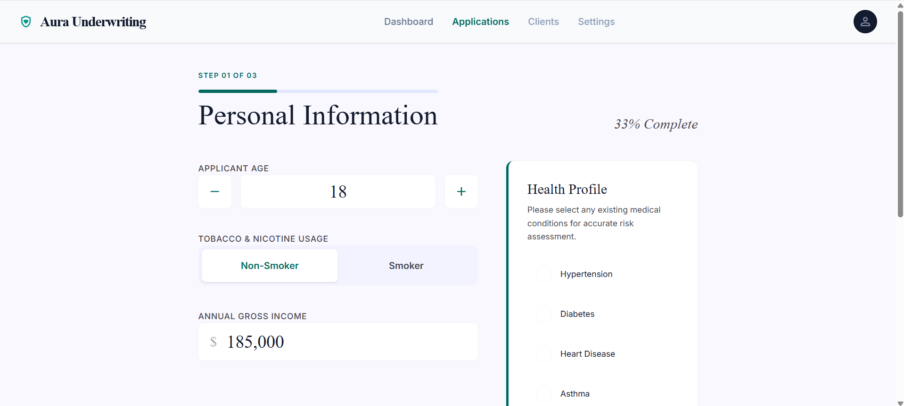

# Aura Underwriting

A modern underwriting simulation built with Next.js, TypeScript, Tailwind CSS, and an AI-assisted interpretation layer for health follow-up responses.

## What it does

AI-powered life insurance underwriting simulator that collects structured health data, runs dynamic risk scoring, and outputs real-time premium evaluations. Built to demonstrate domain-specific tool-building and TypeScript data modelling.

Aura Underwriting models a life insurance-style intake workflow through a structured multi-step experience rather than a free-form chatbot. The app combines a polished frontend, deterministic underwriting logic, and server-side AI extraction to simulate how real underwriting software can guide users through sensitive health and coverage questions.

## Features

* 3-step underwriting flow
   * Personal Information
   * Coverage & Product Selection
   * Final Review
* React Context state management
   * Stores applicant data across the entire workflow
* Session persistence
   * Keeps progress during the session with `sessionStorage`
* Deterministic underwriting engine
   * Premiums and decisions are calculated in application code
* AI-assisted health interpretation
   * Converts free-text follow-up answers into structured underwriting data
* Rule-based underwriting decisions
   * Supports:
      * approved
      * provisional
      * manual review
      * declined
* Fallback-safe design
   * If AI interpretation fails, the app falls back to deterministic local mapping logic

## Demo Workflow

### Step 1 — Personal Information

Users provide:

* age
* smoker / non-smoker status
* annual income
* pre-existing health conditions

### Step 2 — Coverage & Product Selection

Users choose:

* coverage amount
* insurance product type

Available products:

* Term Life
* Final Expense

### Step 3 — Review

The application displays:

* applicant summary
* selected product and coverage
* health declarations
* underwriting notes
* premium or ineligibility status
* risk tier and underwriting outcome

## Health Follow-Up Flow

If a user selects certain flagged conditions, the app launches a guided follow-up modal for additional underwriting information.

Flagged conditions currently include:

* diabetes
* heart disease
* stroke
* cancer

The modal captures raw answers, sends them to a server route, and attempts to convert them into structured JSON for underwriting evaluation.

Example structured output for cancer:

```
{
  "cancer": {
    "type": "melanoma",
    "status": "remission",
    "yearsAgo": 5,
    "occurrences": 1,
    "isActive": false
  }
}
```

## Tech Stack

* Next.js
* TypeScript
* Tailwind CSS
* Vercel

## Run Locally

```bash
npm install
npm run dev
```
